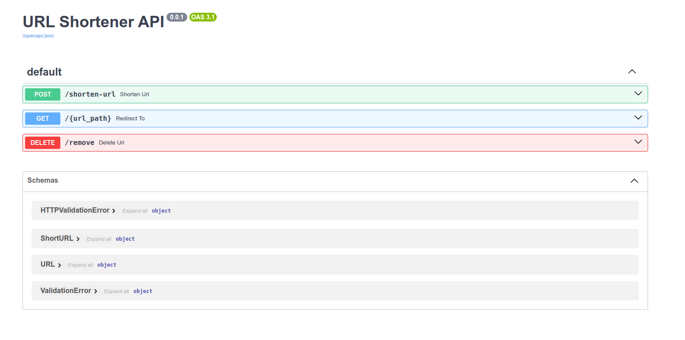

# Short URL Generator

Use the following API to create a short version of your URLs.

### Requirements:
- Docker : version 24.0.6
- docker-compose : version 1.25.0

### Set Up

Create .env file and set up environment variables for PostgreSQL

```
cp .env.example .env
```

Build the Docker images for your FastAPI app and PostgreSQL database, and then start them as containers.

```
docker-compose up --build
```

### Swagger UI

Test API using [Swagger UI](http://localhost:8000/docs)



## API Endpoints

### /shorten-url

Create a short version of the given URL.

Sample Input:

- {"long_url": "https://www.youtube.com/watch?v=L0q7WOUzYv0"}

Sample Output:

- {"short_url": "http://127.0.0.1:8000/MfXDe8"}

### /{url_path}

Use the obtained short URL in the address bar of your browser to check if it redirects correctly.

### /remove

Use the following endpoint to remove certain URLs from the database.

Sample Input:

- {"short_url": "http://127.0.0.1:8000/MfXDe8"}